# Theme examples

mdjango ships **one** house style — flat, monochrome, typographic — and there is no menu of themes
to pick from. What a Consumer *can* change is the [Override surface](../why-the-house-style-is-fixed/):
the seven CSS seeds (the two ends of each colour Ramp, one accent, the body font, the base size),
set in a stylesheet you point [`MDJANGO_EXTRA_CSS`](../../how-to/change-colours-and-type/) at.

The six palettes below are **examples of what that hook expresses**, not themes mdjango offers.
Each is a ~40-line stylesheet setting colour seeds for light and dark plus one `--font`; the layout,
the spacing, and the IBM Plex Mono code face are the fixed house style in every one. Click any
screenshot to open it full size.

## Ocean

Blue accent, IBM Plex Sans — a humanist sans that pairs with the house mono.

<div class="compare">
<figure><a href="theme-gallery/ocean-light.png">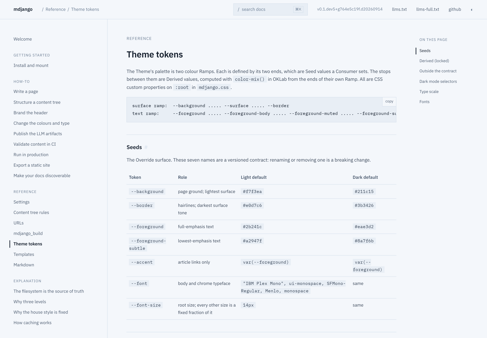</a><figcaption>Light</figcaption></figure>
<figure><a href="theme-gallery/ocean-dark.png">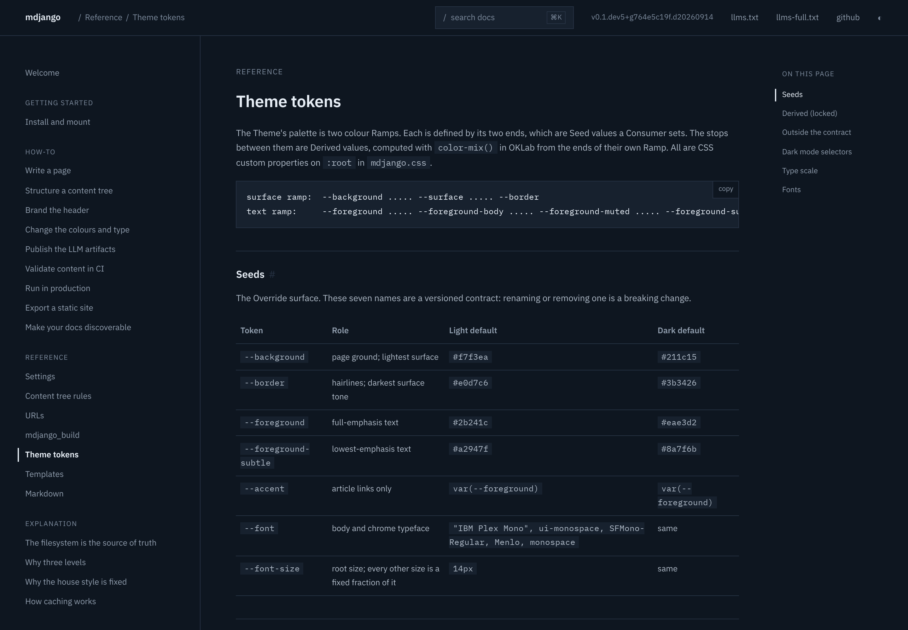</a><figcaption>Dark</figcaption></figure>
</div>

```css
:root {
  --background: #f4f7fb;
  --border: #d6e0ec;
  --foreground: #16202e;
  --foreground-subtle: #6b7d93;
  --accent: #2563eb;
  --font: "IBM Plex Sans", system-ui, sans-serif;
}
:root[data-theme="dark"] {
  --background: #0e1620;
  --border: #263243;
  --foreground: #e6edf5;
  --foreground-subtle: #7c8a9c;
  --accent: #5b9dff;
}
@media (prefers-color-scheme: dark) {
  :root:not([data-theme="light"]) {
    --background: #0e1620;
    --border: #263243;
    --foreground: #e6edf5;
    --foreground-subtle: #7c8a9c;
    --accent: #5b9dff;
  }
}
```

## Claret

Crimson accent, Playfair Display — a high-contrast didone serif for a more editorial voice.

<div class="compare">
<figure><a href="theme-gallery/claret-light.png">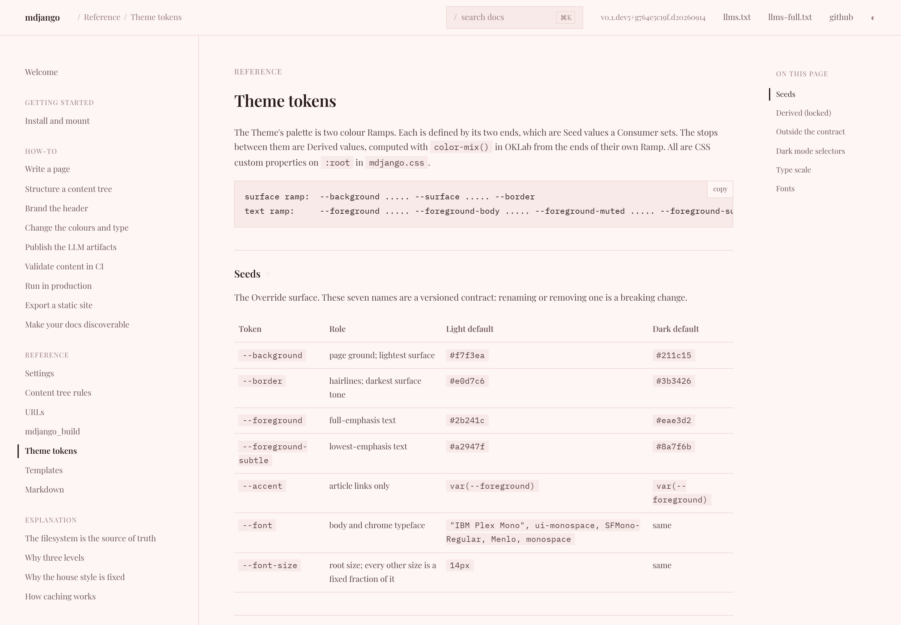</a><figcaption>Light</figcaption></figure>
<figure><a href="theme-gallery/claret-dark.png">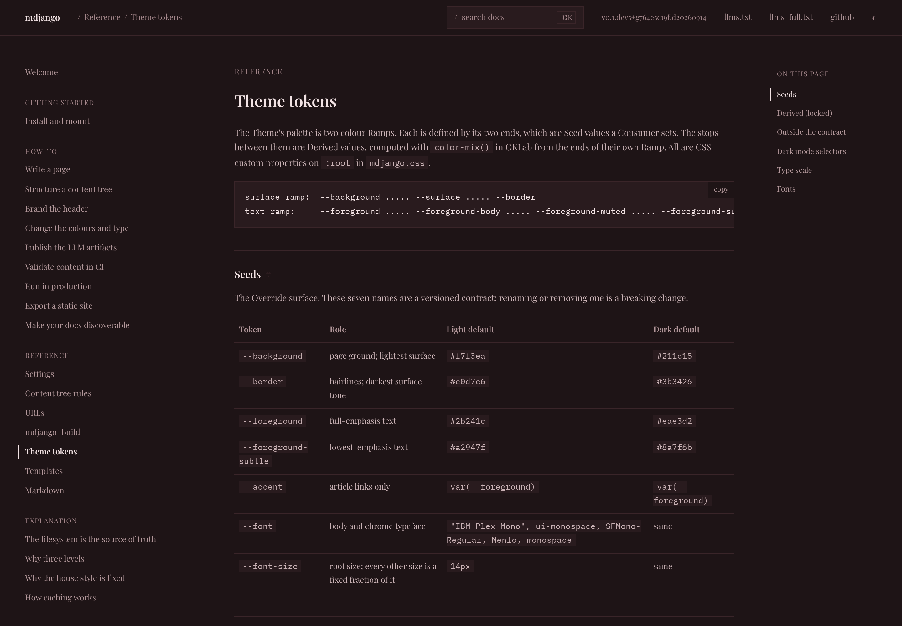</a><figcaption>Dark</figcaption></figure>
</div>

```css
:root {
  --background: #fdf6f5;
  --border: #f0d9d6;
  --foreground: #2a1a1c;
  --foreground-subtle: #9a7b7d;
  --accent: #c02b4e;
  --font: "Playfair Display", Georgia, serif;
}
:root[data-theme="dark"] {
  --background: #1e1416;
  --border: #3a2529;
  --foreground: #f2e3e4;
  --foreground-subtle: #a3868a;
  --accent: #ff6b8a;
}
@media (prefers-color-scheme: dark) {
  :root:not([data-theme="light"]) {
    --background: #1e1416;
    --border: #3a2529;
    --foreground: #f2e3e4;
    --foreground-subtle: #a3868a;
    --accent: #ff6b8a;
  }
}
```

## Forest

Green accent, Roboto Slab — a slab serif with a sturdier, more technical feel.

<div class="compare">
<figure><a href="theme-gallery/forest-light.png">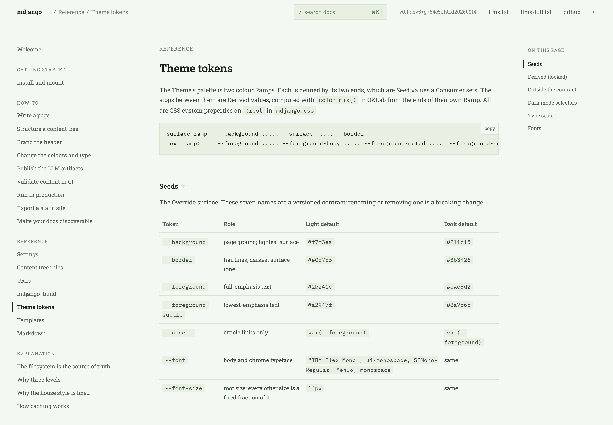</a><figcaption>Light</figcaption></figure>
<figure><a href="theme-gallery/forest-dark.png">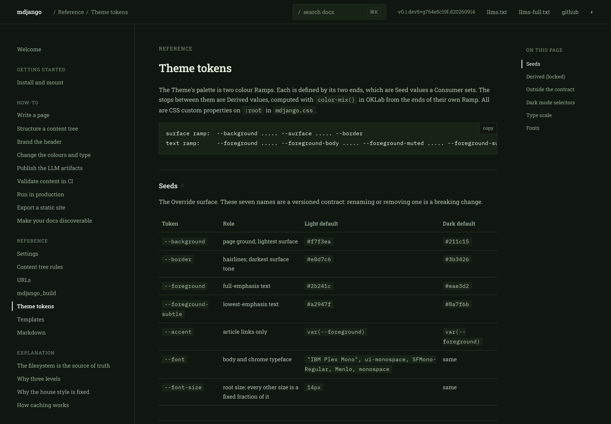</a><figcaption>Dark</figcaption></figure>
</div>

```css
:root {
  --background: #f4f8f2;
  --border: #d6e4d0;
  --foreground: #182119;
  --foreground-subtle: #6d8070;
  --accent: #2f8f4e;
  --font: "Roboto Slab", Rockwell, serif;
}
:root[data-theme="dark"] {
  --background: #101711;
  --border: #26331f;
  --foreground: #e4efe2;
  --foreground-subtle: #85977f;
  --accent: #58c07a;
}
@media (prefers-color-scheme: dark) {
  :root:not([data-theme="light"]) {
    --background: #101711;
    --border: #26331f;
    --foreground: #e4efe2;
    --foreground-subtle: #85977f;
    --accent: #58c07a;
  }
}
```

## Graphite

Blue accent, Inter — a neutral geometric-humanist sans, near-black text on cool greys.

<div class="compare">
<figure><a href="theme-gallery/graphite-light.png">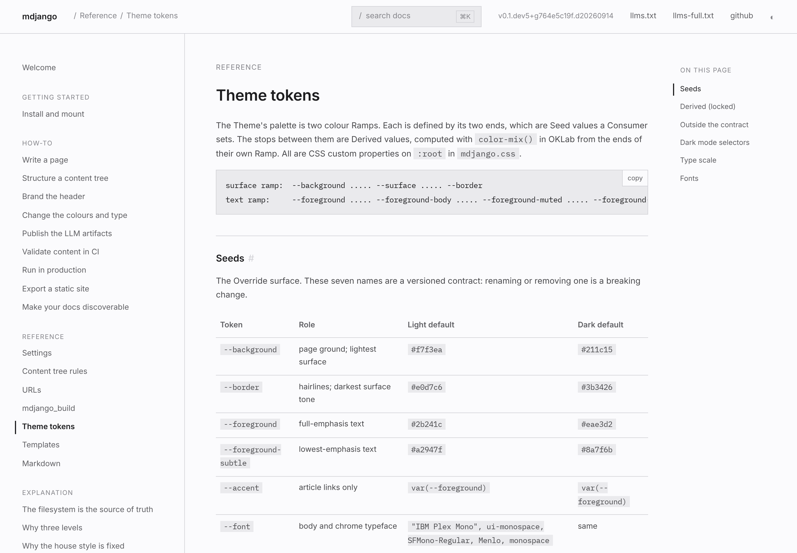</a><figcaption>Light</figcaption></figure>
<figure><a href="theme-gallery/graphite-dark.png">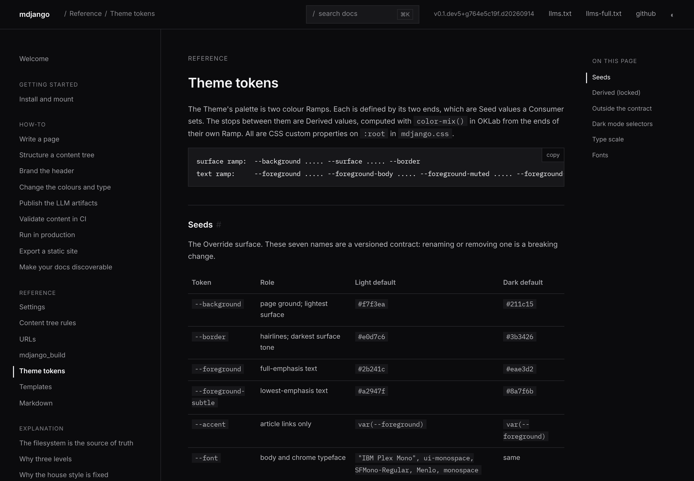</a><figcaption>Dark</figcaption></figure>
</div>

```css
:root {
  --background: #fbfbfd;
  --border: #d2d2d7;
  --foreground: #1d1d1f;
  --foreground-subtle: #86868b;
  --accent: #0071e3;
  --font: "Inter", -apple-system, "SF Pro Text", system-ui, sans-serif;
  --font-size: 15px;
}
:root[data-theme="dark"] {
  --background: #0b0b0d;
  --border: #2a2a2e;
  --foreground: #f5f5f7;
  --foreground-subtle: #86868b;
  --accent: #2997ff;
}
@media (prefers-color-scheme: dark) {
  :root:not([data-theme="light"]) {
    --background: #0b0b0d;
    --border: #2a2a2e;
    --foreground: #f5f5f7;
    --foreground-subtle: #86868b;
    --accent: #2997ff;
  }
}
```

## Ember

Red accent, Montserrat — a geometric sans, crisp white to charcoal.

<div class="compare">
<figure><a href="theme-gallery/ember-light.png">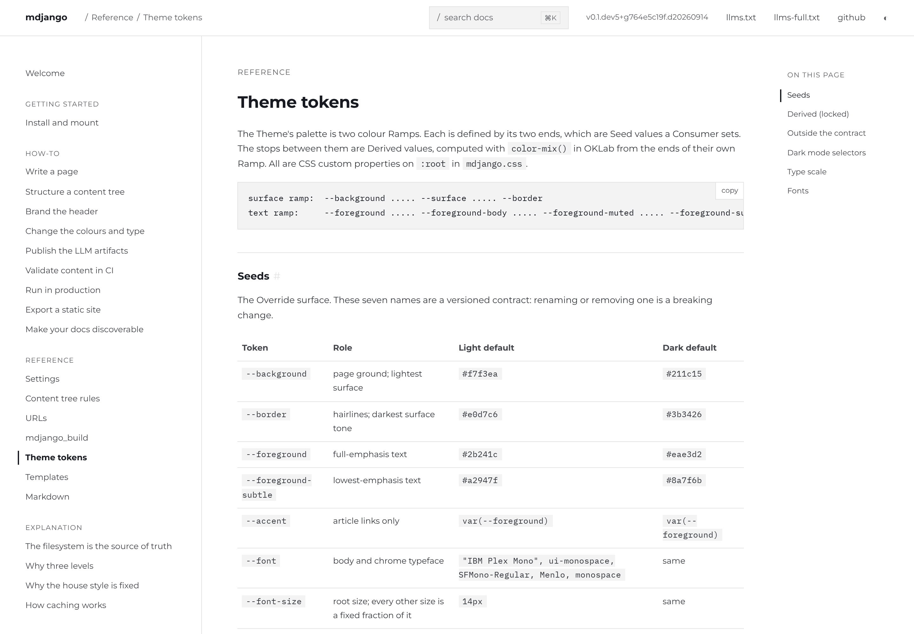</a><figcaption>Light</figcaption></figure>
<figure><a href="theme-gallery/ember-dark.png">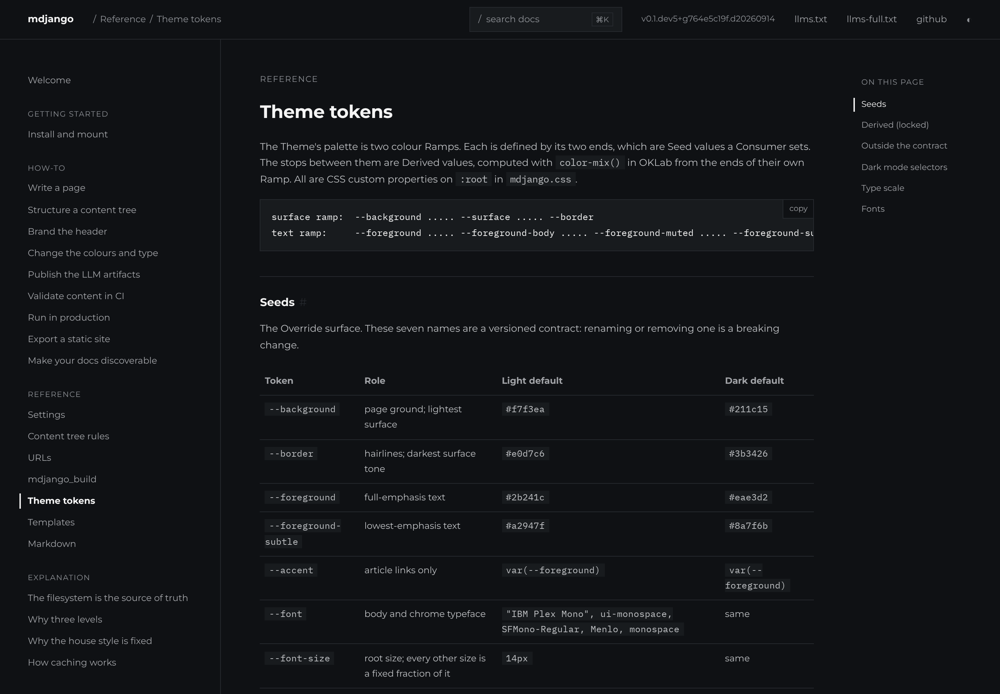</a><figcaption>Dark</figcaption></figure>
</div>

```css
:root {
  --background: #ffffff;
  --border: #e3e3e3;
  --foreground: #171a20;
  --foreground-subtle: #5c5e62;
  --accent: #e82127;
  --font: "Montserrat", "Gotham", "Helvetica Neue", Arial, sans-serif;
}
:root[data-theme="dark"] {
  --background: #0f1114;
  --border: #26292e;
  --foreground: #f4f4f4;
  --foreground-subtle: #8e9196;
  --accent: #ff3b3f;
}
@media (prefers-color-scheme: dark) {
  :root:not([data-theme="light"]) {
    --background: #0f1114;
    --border: #26292e;
    --foreground: #f4f4f4;
    --foreground-subtle: #8e9196;
    --accent: #ff3b3f;
  }
}
```

## Indigo

Indigo accent, Space Grotesk — a grotesque sans over cool blue-slate and deep navy.

<div class="compare">
<figure><a href="theme-gallery/indigo-light.png">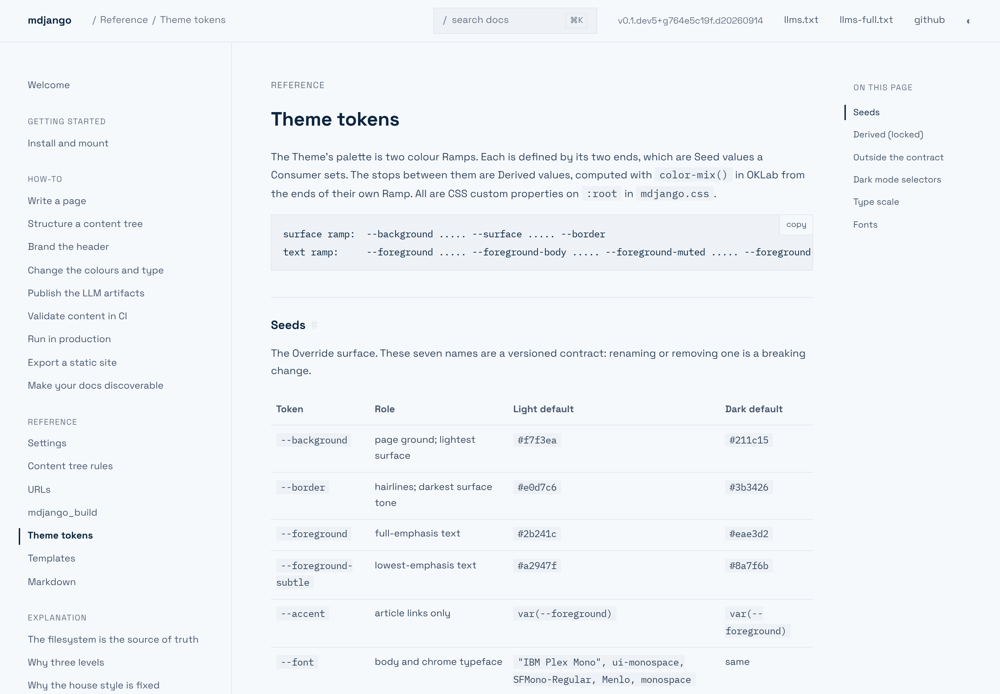</a><figcaption>Light</figcaption></figure>
<figure><a href="theme-gallery/indigo-dark.png">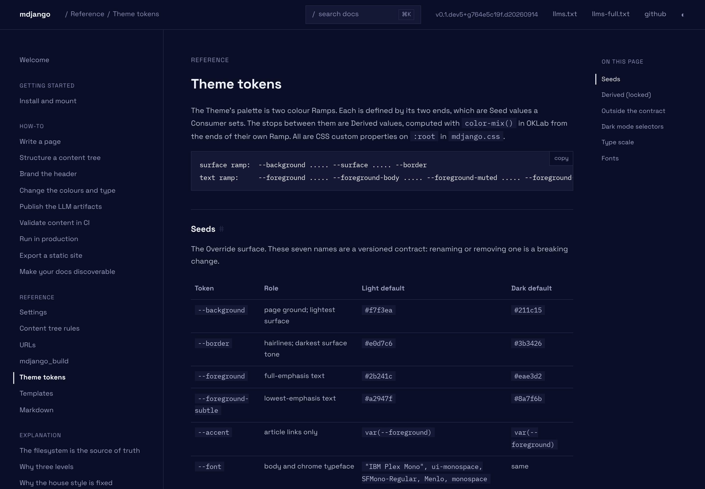</a><figcaption>Dark</figcaption></figure>
</div>

```css
:root {
  --background: #f6f9fc;
  --border: #e3e8ee;
  --foreground: #0a2540;
  --foreground-subtle: #697386;
  --accent: #635bff;
  --font: "Space Grotesk", "Sohne", system-ui, sans-serif;
  --font-size: 15px;
}
:root[data-theme="dark"] {
  --background: #0a0e27;
  --border: #232748;
  --foreground: #eef1f8;
  --foreground-subtle: #878db3;
  --accent: #8b85ff;
}
@media (prefers-color-scheme: dark) {
  :root:not([data-theme="light"]) {
    --background: #0a0e27;
    --border: #232748;
    --foreground: #eef1f8;
    --foreground-subtle: #878db3;
    --accent: #8b85ff;
  }
}
```

## Building one

Every palette here is the same shape: colour seeds set twice (once for the toggle, once for the
system-dark reader) and one `--font`. Nothing else is touched, and nothing is selected at runtime —
you commit to one and it *is* your docs. To build your own, follow
[Change the colours and type](../../how-to/change-colours-and-type/); the token names and their
Derived stops are in the [theme tokens reference](../../reference/theme-tokens/).
